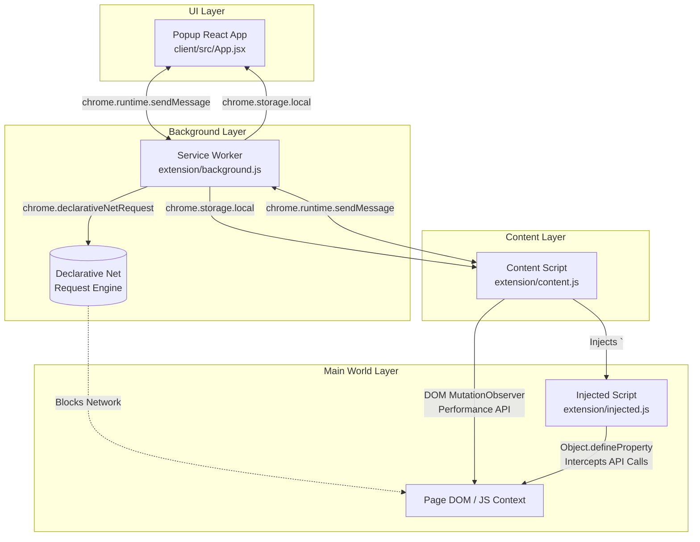
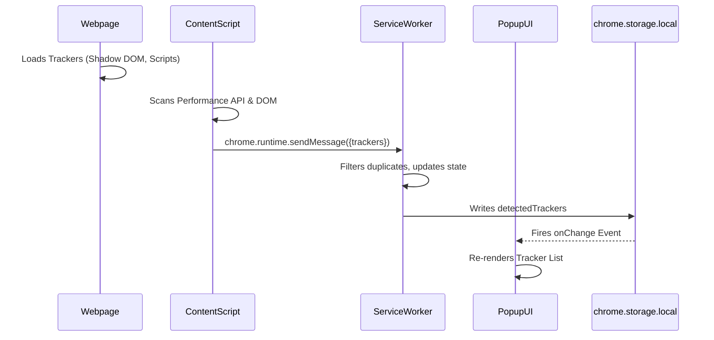

# UbiquiShield Architecture & Technical Documentation
*(Version: v1.1.4 Pre-release)*

UbiquiShield is a modern, high-performance privacy and anti-tracking extension built exclusively for Chrome's Manifest V3 (MV3). This document provides an in-depth look at the architecture, algorithms, and APIs that power the extension.

---

## 1. System Architecture

The extension is divided into four distinct execution environments, strictly enforced by MV3 security policies. They communicate asynchronously via Chrome's Message Passing API.



### Component Breakdown
1. **Service Worker (`background.js`)**: The central brain. It manages global state, syncs settings, and orchestrates the Declarative Net Request (DNR) dynamic rules.
2. **Content Script (`content.js`)**: Runs in an isolated world on every webpage. It is responsible for Cosmetic Filtering (hiding ad frames), scraping tracker data for the UI, and injecting the anti-fingerprinting script.
3. **Injected Script (`injected.js`)**: Injected directly into the `MAIN` world of the webpage. This is necessary because Content Scripts cannot intercept native JavaScript APIs (like Canvas or AudioContext) used by fingerprinting scripts.
4. **React Client (`App.jsx`)**: The popup UI. It uses React 18 and TailwindCSS for a dynamic, glassmorphic interface, completely driven by `chrome.storage.local` reactivity.

---

## 2. Core Algorithms

### A. Network Blocking Algorithm (DNR)
Unlike legacy adblockers (Manifest V2) that intercepted requests using `chrome.webRequest.onBeforeRequest` (which slowed down the browser), UbiquiShield uses the ultra-fast native **Declarative Net Request (DNR)** engine.

- **Static Rules (`rules.json`)**: A compiled blocklist of 66,000+ regex and wildcard patterns representing known trackers and ad domains. Chrome evaluates these rules natively in C++ before the network request even hits the network stack.
- **Dynamic Rules (`background.js`)**: Used for the "Shields Down" whitelist feature. When a user whitelists a site, the background script pushes a high-priority `allowAllRequests` rule to the DNR engine for that specific domain.

```json
{
  "id": 100000,
  "priority": 100,
  "action": { "type": "allowAllRequests" },
  "condition": { "initiatorDomains": ["example.com"] }
}
```

### B. Tracker Detection Algorithm (UI Sync)
To show the user exactly *what* is being blocked without causing performance lag, the UI scanner utilizes a dual-engine approach:

1. **Light DOM Scanning**: Inspects `src` attributes of `<script>`, `<iframe>`, and `` tags.
2. **Shadow DOM / Fetch Scanning**: Uses the `window.performance.getEntriesByType("resource")` API. This completely bypasses the DOM and captures raw network events, effortlessly detecting hidden trackers inside Shadow DOM components or background Web Workers.



### C. Cosmetic Filtering
Some ads are injected directly into the HTML without a network request, or leave empty white boxes when their network payload is blocked. The cosmetic filter uses CSS selectors to aggressively hide these elements.

- **Algorithm**: A `MutationObserver` watches the DOM for changes. Upon detecting changes, it iterates over known ad-selectors (`[id^="ad-"]`, `ins.adsbygoogle`, etc.) and applies `display: none !important;`.
- **Optimization**: To prevent freezing the browser on heavy DOM mutations (like infinite scrolling), the observer is throttled and debounced by 1000ms.

---

## 3. Advanced Anti-Fingerprinting Engine

Browser fingerprinting is the practice of identifying users based on their hardware and software configurations without using cookies. UbiquiShield counters this by spoofing native browser APIs in the `MAIN` world context (`injected.js`).

### Context Tracking & Canvas Spoofing
Canvas fingerprinting draws an invisible image and calculates its cryptographic hash. UbiquiShield counters this via two vectors:
1. **Canvas Exports (`toDataURL`, `toBlob`)**: We intercept these methods to draw an imperceptible `rgba(1,1,1,0.01)` 1x1 pixel, altering the image hash.
2. **Direct Pixel Extraction (`getImageData`)**: We intercept `CanvasRenderingContext2D.prototype.getImageData` and shift the mathematical value of the first pixel in the returned `Uint8ClampedArray`. This neutralizes pixel-level hash extraction while keeping the physical visual canvas completely pristine.

**The Canvas Corruption Bug Fix**:
Canvases can only have one context type (`2d` or `webgl`). Blindly calling `.getContext("2d")` to inject noise will permanently corrupt a virgin canvas destined for WebGL.
- **Algorithm**: We intercept `getContext` and utilize a `WeakMap` to silently track the context type of every canvas in memory. We only inject noise if `contextTypes.get(canvas) === "2d"`.

### Hardware & WebGL Spoofing
We intercept `Object.getOwnPropertyDescriptor` and `WebGLRenderingContext` to return generic, randomized, or mocked values:
- **`navigator.hardwareConcurrency`**: Spoofed to `8`
- **`navigator.deviceMemory`**: Spoofed to `8`
- **`WebGL getParameter`**: Spoofed to generic `ANGLE (Generic GPU)` and `Google Inc.`

### WebGL readPixels Noise
Instead of modifying the visual canvas (which breaks visual applications), we intercept the exact moment the script attempts to *read* the pixels (`readPixels`), and slightly shift the color values in the resulting data array.

### High-Precision Font Fingerprinting Protection
Advanced trackers detect installed system fonts by measuring the exact sub-pixel dimensions of hidden `<span>` tags.
- **Integer Spoofing**: We override `offsetWidth` and `offsetHeight`.
- **Sub-Pixel Spoofing**: Trackers use `Element.prototype.getBoundingClientRect()` and `getClientRects()` to obtain high-precision floats (e.g., `12.1524px`). We intercept these DOM APIs specifically for `<span>` tags and inject a microscopic float variance (`±0.1px`) into the returned `DOMRect` dimensions. This successfully blinds the font-rendering hash algorithm.

### Timezone Spoofing
Instead of injecting scripts into the page context, UbiquiShield hooks the native browser APIs at the extension layer.
- `Intl.DateTimeFormat.prototype.resolvedOptions()` is overridden to always return `UTC`.
- `Date.prototype.getTimezoneOffset()` is overridden to always return `0`.
- This ensures cryptographically sound and consistent timezone masking, preventing bot-detection systems from flagging timezone anomalies.

---

## 4. API & Storage Interfaces

### `chrome.storage.local` Data Structure
UbiquiShield relies entirely on Chrome's local storage for state persistence and reactive UI updates.

| Key | Type | Description |
|---|---|---|
| `settings` | `Object` | Global user preferences (trackerBlocking, httpsUpgrade, etc.) |
| `siteSettings` | `Object` | Per-domain whitelist (`{ "google.com": false }`) |
| `blockedCount` | `Number`/`String` | Total resources blocked on the active tab (e.g., `45` or `"100+"`) |
| `detectedTrackers` | `Array` | Array of objects detailing the specific tracker domains found |

### Subdomain Traversal Whitelisting
When a user toggles the shield for a site (e.g., `mail.google.com`), the extension uses a traversal algorithm to check site settings hierarchically.
1. Check `mail.google.com`
2. Check `google.com`
This ensures that whitelisting a root domain cascades down to its subdomains, preventing the user from having to whitelist every single subdomain individually.

---

## 5. Security & Privacy Constraints

- **No Remote Code Execution**: All rules (`rules.json`) and databases (`trackers.json`) are shipped locally within the extension.
- **Strict MV3 Compliance**: No background pages. The Service Worker spins up on demand and shuts down when idle, minimizing RAM usage to near zero.
- **Cookie Auto-Cleanup**: The extension automatically seeks and destroys known third-party tracking cookies (`_ga`, `_fbp`, `_hjSession`) directly via `document.cookie` manipulation.
