# UbiquiShield Architecture & Technical Documentation
*(Version: v1.2.0)*

UbiquiShield is a modern, high-performance privacy and anti-tracking extension built for Manifest V3 (MV3). It runs natively on all Chromium-based browsers (Chrome, Edge, Brave, Opera, Vivaldi) and Mozilla Firefox. This document provides a comprehensive, in-depth look at every layer of the architecture — from the execution model and inter-process communication, down to the individual algorithms that power each protection feature.

---

## Table of Contents

1. [System Architecture Overview](#1-system-architecture-overview)
2. [Execution Environments](#2-execution-environments)
3. [Inter-Process Communication](#3-inter-process-communication)
4. [Network Protection Engine](#4-network-protection-engine)
5. [Cosmetic Filtering Engine](#5-cosmetic-filtering-engine)
6. [Anti-Fingerprinting Engine](#6-anti-fingerprinting-engine)
7. [Per-Site Protection System](#7-per-site-protection-system)
8. [Blocked Counter & Tracker Detection](#8-blocked-counter--tracker-detection)
9. [Cross-Browser Build Pipeline](#9-cross-browser-build-pipeline)
10. [Storage Schema](#10-storage-schema)
11. [Security & Privacy Constraints](#11-security--privacy-constraints)

**Appendix A — Formal Diagrams**

- [A.1 Data Flow Diagram (DFD)](#a1-data-flow-diagram-dfd)
- [A.2 System Flow Diagram](#a2-system-flow-diagram)
- [A.3 Class Diagram](#a3-class-diagram)
- [A.4 Sequence Diagrams](#a4-sequence-diagrams)
- [A.5 Use Case Diagram](#a5-use-case-diagram)
- [A.6 Entity Relationship Diagram (ERD)](#a6-entity-relationship-diagram-erd)

---

## 1. System Architecture Overview

UbiquiShield is divided into four distinct execution environments, strictly enforced by MV3 security policies. Each environment is sandboxed by the browser and can only communicate with others through well-defined Chrome Extension APIs.

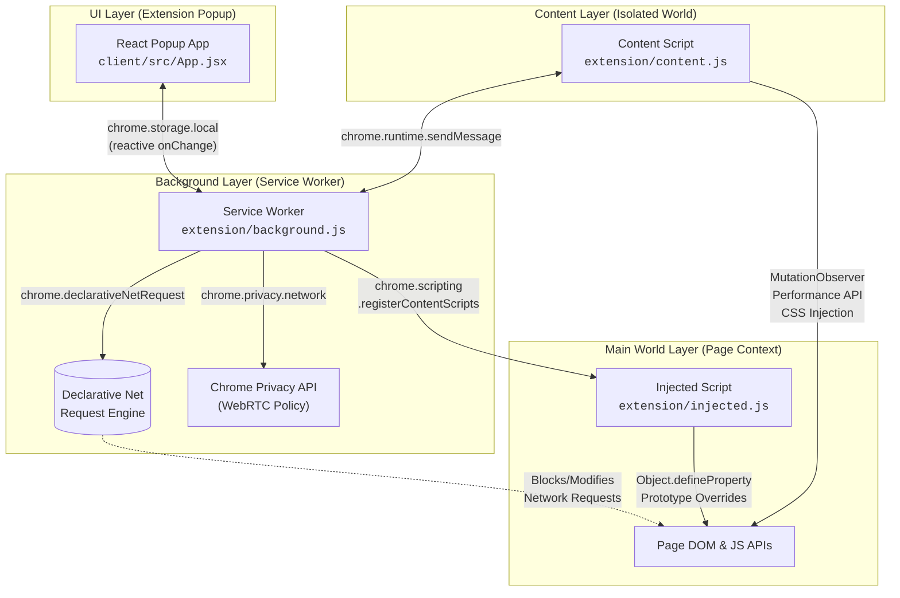

### Design Philosophy

The architecture follows three core principles:

1. **Defense in Depth**: Protection is applied at three independent layers — network (DNR), DOM (content script), and JavaScript runtime (injected script). Even if one layer is bypassed, the others still provide coverage.
2. **Zero Performance Impact**: All network blocking is delegated to the browser's native C++ DNR engine, which runs off the main thread. The service worker only activates on-demand and shuts down when idle.
3. **Undetectability**: Every hooked API passes `Function.prototype.toString` inspection, returning `[native code]` to fingerprinting scripts that attempt to detect tampering.

---

## 2. Execution Environments

### 2.1 Service Worker (`background.js`)

The service worker is the central orchestrator of the extension. It has no access to the DOM but has full access to all Chrome Extension APIs.

**Responsibilities:**
- Managing the Declarative Net Request engine (enabling/disabling rulesets, pushing dynamic rules)
- Generating dynamic DNR rules for header spoofing, HTTPS upgrades, URL parameter stripping, per-site whitelists, and script blocking
- Registering and unregistering the `injected.js` MAIN world content script dynamically based on user settings
- Configuring the WebRTC IP handling policy via `chrome.privacy.network`
- Tracking per-tab state: hostname, navigation timestamp, detected trackers
- Handling messages from the content script (tracker reports) and the popup (toggle site, update counter)
- Syncing blocked count and detected tracker data to `chrome.storage.local` for popup reactivity

**Lifecycle:** Under MV3, the service worker has no persistent background page. It spins up on events (install, tab change, message, storage change) and is automatically terminated by the browser when idle, keeping RAM usage near zero.

### 2.2 Content Script (`content.js`)

The content script runs in an **isolated world** on every webpage. It shares the same DOM as the page but has a completely separate JavaScript execution context.

**Responsibilities:**
- **Cosmetic Filtering**: Injects a `<style>` element with CSS selectors that hide known ad containers, cookie consent banners, and sponsored content across major platforms.
- **Ad Wrapper Collapsing**: Uses a `MutationObserver` to detect and collapse empty `<div>` elements that served as wrappers for blocked ad iframes.
- **Tracker Detection & Reporting**: Scans the DOM (`<script>`, `<iframe>`, `` elements) and the `Performance API` (`getEntriesByType("resource")`) to identify tracker domains, then reports them to the service worker.
- **Third-Party Cookie Cleanup**: Periodically scrubs known tracking cookies (`_ga`, `_gid`, `_fbp`, `_fbc`, `_hjSession*`, `_uetmsclkid`, `__gads`) from `document.cookie`.
- **Script Blocking**: When the "Block Scripts" toggle is enabled, removes `<script>` tags whose `src` matches known tracking script domains.

**Why Isolated World?** Content scripts cannot intercept or override native JavaScript APIs (like `CanvasRenderingContext2D.prototype.toDataURL`) because they run in a separate V8 context. This is why the injected script exists.

### 2.3 Injected Script (`injected.js`)

The injected script runs in the **MAIN world** — the same JavaScript execution context as the webpage itself. This is the only way to intercept native browser APIs before fingerprinting scripts can call them.

**Injection Mechanism:** The service worker uses `chrome.scripting.registerContentScripts` with `world: "MAIN"` and `runAt: "document_start"` to ensure the script executes before any page JavaScript. This is superior to the legacy approach of injecting `<script>` tags from a content script, because:
1. It executes synchronously before `document_start`, preventing race conditions.
2. It respects per-site exclude lists managed by the service worker.
3. It survives page navigation without re-injection.

**Responsibilities:**
- Spoofing all navigator properties (hardware, language, plugins, mimeTypes, connection, platform, userAgentData)
- Intercepting Canvas 2D APIs (`toDataURL`, `toBlob`, `getImageData`)
- Intercepting WebGL/WebGL2 APIs (`getParameter`, `getExtension`, `readPixels`)
- Intercepting OffscreenCanvas APIs
- Intercepting Audio APIs (`getChannelData`)
- Spoofing font measurement APIs (`offsetWidth`, `offsetHeight`, `getBoundingClientRect`, `getClientRects`)
- Neutralizing the Battery Status API
- Spoofing timezone APIs (`getTimezoneOffset`, `Intl.DateTimeFormat`)
- Masking all hooked functions via `Function.prototype.toString` proxy

### 2.4 React Popup (`client/src/App.jsx`)

The popup is a self-contained React 19 application compiled by Vite into static HTML/CSS/JS assets that are served from `extension/index.html`.

**Responsibilities:**
- Displaying the real-time blocked tracker count for the active tab
- Listing detected tracker domains with category labels (analytics, advertising, social, fingerprinting)
- Providing toggle switches for all protection settings (Tracker Blocking, HTTPS Upgrade, Script Blocking, Fingerprint Protection, Third-Party Cookies)
- Providing a per-site "Shields Down" toggle
- All state is driven reactively by `chrome.storage.local.onChanged` listeners

**UI Framework:** The popup uses a custom dark glassmorphic theme built with vanilla CSS, with icons from the Lucide React library.

---

## 3. Inter-Process Communication

MV3 enforces strict process isolation. The four environments communicate through three distinct channels:

### 3.1 Chrome Storage (Reactive State Bus)

`chrome.storage.local` acts as a reactive state bus between the popup and the service worker. When the popup toggles a setting, it writes directly to storage. The service worker listens for `chrome.storage.onChanged` and re-applies all protection rules.

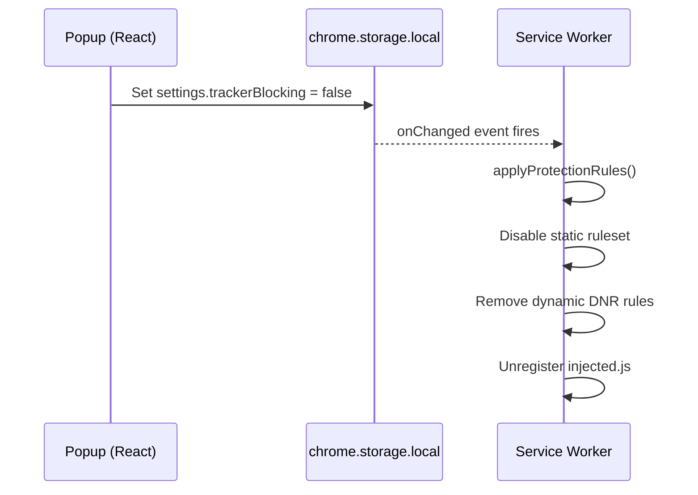

### 3.2 Chrome Runtime Messages (Direct RPC)

The content script uses `chrome.runtime.sendMessage` to send tracker detection reports and counter update requests to the service worker.

| Message Action | Sender | Payload | Purpose |
|---|---|---|---|
| `reportTrackers` | Content Script | `{ trackers: [...] }` | Report detected tracker domains for the current tab |
| `updateCounter` | Popup | `{}` | Request a refresh of the blocked count for the active tab |
| `toggleSite` | Popup | `{ hostname, enabled }` | Toggle per-site protection |

### 3.3 Dynamic Script Registration (One-Way)

The service worker uses `chrome.scripting.registerContentScripts` / `updateContentScripts` / `unregisterContentScripts` to dynamically control whether `injected.js` runs on a given page. This is a one-way control channel — the injected script cannot communicate back to the service worker.

---

## 4. Network Protection Engine

### 4.1 Static Ruleset (`rules.json`)

The static ruleset contains **3,500+ domain-level blocking rules** compiled from curated tracker lists. These rules are declared in the manifest and loaded by the browser's native DNR engine at install time.

**How it works:** The browser evaluates these rules in compiled C++ before the network request even hits the network stack. This is fundamentally faster than legacy MV2 `webRequest.onBeforeRequest` interceptors, which required JavaScript evaluation on every single network request.

```json
{
  "id": 1,
  "priority": 1,
  "action": { "type": "block" },
  "condition": {
    "urlFilter": "||doubleclick.net",
    "resourceTypes": ["script", "image", "sub_frame", "xmlhttprequest"]
  }
}
```

### 4.2 Dynamic Rules (`background.js`)

Dynamic rules are generated at runtime by the service worker based on user settings. They are pushed to the DNR engine via `chrome.declarativeNetRequest.updateDynamicRules`.

#### 4.2.1 Header Spoofing Rules (ID: 99990)

When fingerprint protection is enabled, a high-priority `modifyHeaders` rule rewrites outgoing HTTP headers on every request:

| Header | Spoofed Value | Purpose |
|---|---|---|
| `User-Agent` | `Mozilla/5.0 (Windows NT 10.0; Win64; x64) ... Chrome/120.0.0.0` | Standardize browser identity |
| `Sec-CH-UA` | `"Not_A Brand";v="8", "Chromium";v="120"` | Defeat Client Hints fingerprinting |
| `Sec-CH-UA-Platform` | `"Windows"` | Standardize OS identity |
| `Accept-Language` | `en-US,en;q=0.9` | Prevent language-based tracking |

This rule covers **all resource types** (main_frame, sub_frame, script, image, font, xhr, websocket, etc.) ensuring no request leaks the real browser identity.

#### 4.2.2 HTTPS Upgrade Rules (ID: 99999)

An `upgradeScheme` rule intercepts all `http://` requests to main frames and sub-frames and silently upgrades them to `https://`.

#### 4.2.3 URL Tracking Parameter Stripping (ID: 99998)

A `redirect` rule with a `queryTransform` removes 25+ known tracking parameters from URLs before navigation completes:

```
utm_source, utm_medium, utm_campaign, utm_term, utm_content, utm_name,
fbclid, gclid, msclkid, mc_eid, igshid, yclid, _openstat, wickedid,
otc, oly_enc_id, oly_anon_id, rb_clickid, wbraid, gbraid, twclid,
s_cid, mkt_tok, zanpid, cx_cmp
```

#### 4.2.4 Script Blocking Rules (IDs: 99800–99830)

When the "Block Scripts" toggle is enabled, individual `block` rules are generated for 30+ tracking script domains. These block requests at the network level before the script can execute, which is more reliable than the content script's DOM-based `<script>` removal.

**Blocked domains include:**
`google-analytics.com`, `googletagmanager.com`, `connect.facebook.net`, `static.hotjar.com`, `clarity.ms`, `snap.licdn.com`, `analytics.tiktok.com`, `cdn.mxpnl.com`, `cdn.segment.com`, `widgets.outbrain.com`, `cdn.taboola.com`, `static.criteo.net`, `bat.bing.com`, `sb.scorecardresearch.com`, `securepubads.g.doubleclick.net`, `rs.fullstory.com`, `cdn.mouseflow.com`, and more.

#### 4.2.5 Per-Site Whitelist Rules (IDs: 100000+)

When a user disables protection for a specific domain, a high-priority `allowAllRequests` rule is pushed to the DNR engine:

```json
{
  "id": 100000,
  "priority": 100,
  "action": { "type": "allowAllRequests" },
  "condition": {
    "initiatorDomains": ["example.com"],
    "excludedInitiatorDomains": ["ads.example.com"]
  }
}
```

The `excludedInitiatorDomains` field ensures that if a user has explicitly re-enabled protection on a subdomain, the parent whitelist does not cascade down to it.

#### 4.2.6 EFF Tracker Test Blocking (IDs: 99991–99992)

Specialized blocking rules for `trackertest.org` and `alooodo.com` domains used by the EFF's "Cover Your Tracks" test, ensuring the extension passes automated privacy audits.

---

## 5. Cosmetic Filtering Engine

Some ads are injected directly into the HTML without a network request (native ads), or leave empty white boxes when their network payload is blocked. The cosmetic filter addresses both problems.

### 5.1 CSS Injection

The content script injects a single `<style id="ubiquishield-cosmetic">` element into the document head. The stylesheet uses `display: none !important` to hide elements matching a curated list of CSS selectors.

**Targeted platforms and selectors:**

| Platform | Selectors |
|---|---|
| **Traditional Ads** | `.ad-wrapper`, `.ad-box`, `ins.adsbygoogle`, `[data-ad-slot]`, `iframe[src*="doubleclick"]`, `iframe[src*="taboola"]` |
| **Google Ads** | `[id^="google_ads_"]`, `[id^="div-gpt-ad"]`, `.gpt-ad`, `.dfp-ad` |
| **YouTube** | `ytd-ad-slot-renderer`, `ytd-promoted-sparkles-web-renderer`, `.ytp-ad-module`, `ytd-banner-promo-renderer` |
| **Facebook/Twitter** | `div[data-testid="sponsored-label"]`, `div[data-testid="placementTracking"]` |
| **Reddit** | `.promotedlink`, `[data-is-promoted-post="true"]`, `shreddit-ad-post` |
| **LinkedIn** | `.feed-shared-update-v2--ad`, `div[data-ad-banner]` |
| **Amazon** | `.s-result-item[data-component-type="sp-sponsored-result"]`, `.AdHolder` |
| **Cookie Banners** | `#onetrust-consent-sdk`, `.cookie-banner`, `.qc-cmp2-container`, `.CybotCookiebotDialog`, `[aria-label="Cookie consent"]` |

### 5.2 Ad Wrapper Collapser

When an ad iframe is blocked at the network level, the `<iframe>` element remains in the DOM as an empty rectangle. Often, this element is wrapped in a parent `<div>` that also becomes an empty white box.

**Algorithm:**
1. The `MutationObserver` fires on DOM changes.
2. For every `<iframe>` and `` element, check if its `src` hostname matches the tracker database.
3. If it's a confirmed tracker element, walk up the DOM tree to find the nearest parent `<div>`.
4. If that parent has only one child (the tracker element), collapse the parent with `display: none !important`.
5. If the parent has multiple children, only collapse the tracker element itself.

This prevents false positives where a legitimate page container happens to wrap a single blocked element.

### 5.3 Throttling

To prevent performance degradation on pages with heavy DOM mutations (infinite scroll feeds, SPAs), the cosmetic filtering and ad wrapper collapsing functions are debounced to run at most once per second.

---

## 6. Anti-Fingerprinting Engine

Browser fingerprinting identifies users by collecting unique hardware and software characteristics without cookies. UbiquiShield counters this by overriding native browser APIs in the MAIN world context (`injected.js`) before any page script can read them.

### 6.1 Session Seed

All randomized spoofing values are derived from a single `spoofSeed` generated once per page load:

```javascript
const spoofSeed = Math.random();
const spoofFloat = (spoofSeed - 0.5) * 0.0001;
```

This ensures that:
- Multiple reads of the same API within a single page session return consistent values (preventing detection via inconsistency checks).
- Different page loads produce different values (preventing cross-session tracking).

### 6.2 Canvas Fingerprint Spoofing

Canvas fingerprinting works by drawing invisible text/graphics and computing a hash of the resulting pixel data. UbiquiShield defeats this at three interception points:

#### `toDataURL` and `toBlob`

Before exporting the canvas image, we draw a single invisible 1×1 pixel with `rgba(1, 1, 1, 0.01)` at position `(0, 0)`. This pixel is invisible to the human eye but changes the cryptographic hash of the exported image.

```javascript
const orig2dToDataURL = CanvasRenderingContext2D.prototype.__proto__
  .constructor.prototype // -> HTMLCanvasElement.prototype
  // ... intercept toDataURL on the canvas element
```

**Context Safety:** Before injecting noise, we check a `WeakMap` to ensure the canvas is using a `2d` context. If it's a `webgl` or `webgl2` context (used by games and 3D applications), we skip the noise injection entirely to prevent visual corruption.

#### `getImageData`

We intercept `CanvasRenderingContext2D.prototype.getImageData` and modify the first pixel's RGBA values by adding the session-seeded offset:

```javascript
data[0] = Math.min(255, data[0] + Math.floor(spoofSeed * 3));  // R
data[1] = Math.min(255, data[1] + Math.floor(spoofSeed * 2));  // G
data[2] = Math.min(255, data[2] + Math.floor(spoofSeed * 5));  // B
```

This defeats pixel-level hash extraction while keeping the visual canvas pristine.

### 6.3 WebGL Fingerprint Spoofing

WebGL fingerprinting extracts GPU vendor/renderer strings and rendering characteristics. UbiquiShield defeats this at two levels:

#### `getParameter` (WebGL1 & WebGL2)

We intercept `getParameter` on both `WebGLRenderingContext` and `WebGL2RenderingContext` prototypes. When the page queries the debug renderer info extension:

| Parameter | Real Value | Spoofed Value |
|---|---|---|
| `UNMASKED_VENDOR_WEBGL` | (varies by GPU) | `Google Inc. (Generic GPU)` |
| `UNMASKED_RENDERER_WEBGL` | (varies by GPU) | `ANGLE (Generic GPU, Generic Renderer OpenGL, OpenGL)` |
| `VERSION` | (varies) | `WebGL 1.0 (OpenGL ES 2.0 Chromium)` |
| `SHADING_LANGUAGE_VERSION` | (varies) | `WebGL GLSL ES 1.0 (OpenGL ES GLSL ES 1.0 Chromium)` |
| `MAX_TEXTURE_SIZE` | (varies) | `16384` |

#### `getExtension`

When the page requests the `WEBGL_debug_renderer_info` extension (which provides the unmasked vendor/renderer strings), we return a proxy object whose `UNMASKED_VENDOR_WEBGL` and `UNMASKED_RENDERER_WEBGL` constants point to our spoofed parameter IDs.

#### `readPixels` (WebGL1 & WebGL2)

We intercept `readPixels` and inject microscopic noise into the returned pixel buffer:

```javascript
for (let i = 0; i < pixels.length; i += 4) {
  pixels[i]     = Math.min(255, Math.max(0, pixels[i] + noiseR));     // R
  pixels[i + 1] = Math.min(255, Math.max(0, pixels[i + 1] + noiseG)); // G
  pixels[i + 2] = Math.min(255, Math.max(0, pixels[i + 2] + noiseB)); // B
}
```

The noise values are derived from the session seed, so they are consistent within a page load but different across sessions.

### 6.4 OffscreenCanvas Protection

Modern fingerprinting scripts use `OffscreenCanvas` to perform canvas operations off the main DOM, bypassing traditional content script detection. We intercept `OffscreenCanvasRenderingContext2D.prototype.getImageData` with the same noise injection algorithm used for regular Canvas.

### 6.5 Audio Fingerprint Spoofing

Audio fingerprinting uses `AudioContext` to generate a tone and read the resulting waveform, which varies by hardware. We intercept `AudioBuffer.prototype.getChannelData` and inject a microscopic float offset into each sample:

```javascript
for (let i = 0; i < data.length; i++) {
  data[i] += spoofFloat;  // ~0.00005 amplitude shift
}
```

This shift is imperceptible to the human ear but changes the waveform hash.

### 6.6 Font Fingerprint Spoofing

Advanced trackers detect installed system fonts by measuring the exact pixel dimensions of hidden `<span>` elements rendered in different font families.

#### Integer Dimension Spoofing

We override `offsetWidth` and `offsetHeight` on `HTMLElement.prototype` with property descriptors that add a small integer offset (0–2 pixels) based on the element's text content hash:

```javascript
Object.defineProperty(HTMLElement.prototype, "offsetWidth", {
  get() {
    const val = originalOffsetWidthDesc.get.call(this);
    if (this.tagName === "SPAN") {
      return val + Math.floor(spoofSeed * 3);
    }
    return val;
  }
});
```

#### Sub-Pixel Spoofing

Trackers also use `getBoundingClientRect()` and `getClientRects()` to obtain high-precision float dimensions (e.g., `12.1524px`). We intercept these methods and inject a microscopic float variance (±0.1px) into the returned `DOMRect` dimensions, but **only for `<span>` elements** to prevent breaking layout calculations on other elements.

### 6.7 Navigator Property Spoofing

We override the following `Navigator.prototype` properties using `Object.defineProperty`:

| Property | Spoofed Value | Purpose |
|---|---|---|
| `hardwareConcurrency` | `8` | Hide real CPU core count |
| `deviceMemory` | `8` | Hide real RAM size |
| `language` | `"en-US"` | Standardize language |
| `languages` | `["en-US", "en"]` | Standardize language list |
| `plugins` | 3 generic Chrome plugins | Hide real plugin list |
| `mimeTypes` | `[{ type: "application/pdf" }]` | Standardize MIME types |
| `platform` | `"Win32"` | Standardize OS platform |
| `connection` | `{ effectiveType: "4g", downlink: 10, rtt: 50, saveData: false }` | Standardize network info |
| `doNotTrack` | `"1"` | Signal privacy preference |
| `maxTouchPoints` | `0` | Standardize touch capability |

### 6.8 Client Hints Spoofing

The `navigator.userAgentData` API exposes structured browser/OS information that is harder to spoof than the User-Agent string. We override it completely:

```javascript
Object.defineProperty(Navigator.prototype, "userAgentData", {
  get() {
    return {
      brands: [
        { brand: "Not_A Brand", version: "8" },
        { brand: "Chromium", version: "120" },
        { brand: "Google Chrome", version: "120" }
      ],
      mobile: false,
      platform: "Windows",
      getHighEntropyValues() {
        return Promise.resolve({
          architecture: "x86",
          model: "",
          platform: "Windows",
          platformVersion: "15.0.0",
          uaFullVersion: "120.0.0.0"
        });
      }
    };
  }
});
```

### 6.9 Battery API Neutralization

The Battery Status API can fingerprint users by their exact charge level and charging state. We intercept `navigator.getBattery()` to always return a fully charged, plugged-in profile:

```javascript
navigator.getBattery = function() {
  return Promise.resolve({
    charging: true,
    chargingTime: 0,
    dischargingTime: Infinity,
    level: 1,
    addEventListener() {},
    removeEventListener() {},
    dispatchEvent() { return true; }
  });
};
```

All event listeners are stubbed out so fingerprinting scripts cannot detect charge state changes.

### 6.10 Timezone Spoofing

Timezone fingerprinting cross-references two APIs to detect inconsistencies. UbiquiShield ensures both report the same value:

| API | Spoofed Return Value |
|---|---|
| `Date.prototype.getTimezoneOffset()` | `300` (EST/UTC-5) |
| `Intl.DateTimeFormat().resolvedOptions().timeZone` | `"America/New_York"` |

### 6.11 `toString` Masking

Every hooked function is registered in a `WeakSet`. We proxy `Function.prototype.toString` so that when a fingerprinting script calls `.toString()` on any of our intercepted APIs, it returns:

```
function getParameter() { [native code] }
```

This makes our overrides completely indistinguishable from the browser's native implementations.

---

## 7. Per-Site Protection System

### 7.1 Subdomain Traversal Algorithm

When the popup queries whether a site is protected, it uses a hierarchical domain traversal:

```
1. Check siteSettings["mail.google.com"]     → not found
2. Check siteSettings["google.com"]           → found: false
3. Result: protection is DISABLED for mail.google.com
```

This ensures that whitelisting a root domain cascades to all subdomains without requiring individual entries.

### 7.2 Multi-Layer Disable Cascade

When protection is disabled for a site, the following happens simultaneously:

1. **DNR Layer**: An `allowAllRequests` rule is pushed to the DNR engine for the domain.
2. **Injected Script Layer**: The `injected.js` content script's `excludeMatches` list is updated to include `*://domain/*` and `*://*.domain/*`.
3. **Content Script Layer**: The cosmetic filter checks `siteProtectionEnabled` before injecting CSS.

This ensures complete protection removal at all three layers.

---

## 8. Blocked Counter & Tracker Detection

### 8.1 Production-Safe Blocked Counter

The blocked counter uses `chrome.declarativeNetRequest.getMatchedRules()` to query the number of rules that matched for a specific tab since it was loaded:

```javascript
const result = await chrome.declarativeNetRequest.getMatchedRules({
  tabId: tabId,
  minTimeStamp: tabTimestamps[tabId]
});
const count = result.rulesMatchedInfo.length;
```

**Feature Detection:** Firefox does not yet support `getMatchedRules`. The code includes a runtime check:
```javascript
if (!chrome.declarativeNetRequest.getMatchedRules) {
  return; // Firefox fallback
}
```

**Overflow Handling:** If the count exceeds 100, the popup displays `"100+"` to prevent visual overflow.

### 8.2 Dual-Engine Tracker Detection

The content script uses two complementary detection methods:

1. **DOM Scanning**: Inspects `src` attributes of `<script>`, `<iframe>`, and `` elements and matches their hostnames against the local tracker database (`trackers.json`).
2. **Performance API Scanning**: Calls `window.performance.getEntriesByType("resource")` to capture network requests made by Shadow DOM components, Web Workers, and dynamically created elements that are invisible to DOM scanning.

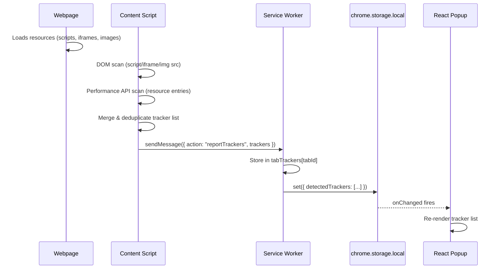

---

## 9. Cross-Browser Build Pipeline

UbiquiShield maintains a single codebase that is automatically packaged for multiple browser stores using a custom Node.js build script (`build.js`).

### 9.1 Build Process

Running `npm run build` executes the following pipeline:

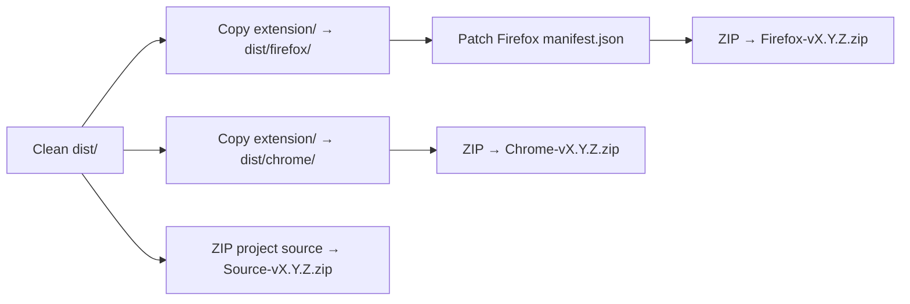

### 9.2 Firefox Manifest Patches

The build script automatically applies three modifications to the Firefox copy of `manifest.json`:

| Change | Chrome Manifest | Firefox Manifest |
|---|---|---|
| Background script format | `"service_worker": "background.js"` | `"scripts": ["background.js"]` |
| Extension ID | (not required) | `"id": "ubiquishield@unmukta.com"` |
| Min version | (not required) | `"strict_min_version": "113.0"` |
| Data collection | (not required) | `"data_collection_permissions": { "required": ["none"] }` |

### 9.3 Firefox Runtime Compatibility

Several Chrome DNR APIs are not yet implemented in Firefox. The codebase uses feature detection to gracefully degrade:

```javascript
// Badge count (Chrome-only)
if (chrome.declarativeNetRequest.setExtensionActionOptions) {
  chrome.declarativeNetRequest.setExtensionActionOptions({
    displayActionCountAsBadgeText: true
  });
}

// Matched rules counter (Chrome-only)
if (!chrome.declarativeNetRequest.getMatchedRules) {
  return; // Skip on Firefox
}
```

### 9.4 Output Files

| File | Target Store | Contents |
|---|---|---|
| `UbiquiShield-Chrome-vX.Y.Z.zip` | Chrome Web Store, Edge Add-ons | Unmodified `extension/` folder |
| `UbiquiShield-Firefox-vX.Y.Z.zip` | Firefox Add-ons (AMO) | Patched manifest + same extension files |
| `UbiquiShield-Source-vX.Y.Z.zip` | AMO source code upload | Full project source (excludes `node_modules`, `.git`, `dist`) with auto-generated `BUILD_INSTRUCTIONS.md` |

---

## 10. Storage Schema

UbiquiShield uses `chrome.storage.local` exclusively. No data is synced, transmitted, or shared.

| Key | Type | Description | Example |
|---|---|---|---|
| `settings` | `Object` | Global user preferences | `{ trackerBlocking: true, httpsUpgrade: true, scriptBlocking: false, fingerprintProtection: true, thirdPartyCookies: true }` |
| `siteSettings` | `Object` | Per-domain protection overrides | `{ "google.com": false, "mail.google.com": true }` |
| `blockedCount` | `Number \| String` | Blocked resources on active tab | `45` or `"100+"` |
| `detectedTrackers` | `Array<Object>` | Tracker domains found on active tab | `[{ domain: "doubleclick.net", category: "advertising" }]` |

---

## 11. Security & Privacy Constraints

### 11.1 No Remote Code Execution
All rules (`rules.json`) and databases (`trackers.json`) are shipped locally within the extension package. The extension makes zero network requests of its own.

### 11.2 Strict MV3 Compliance
- No persistent background pages. The service worker spins up on-demand and shuts down when idle.
- No `eval()`, no `new Function()`, no remote script loading.
- All content scripts are statically declared or registered via `chrome.scripting`.

### 11.3 No Data Collection
- Zero telemetry, zero analytics, zero error reporting.
- All state is stored locally via `chrome.storage.local`.
- The extension does not read or log the content of web pages.
- The extension does not transmit any data to any server.

### 11.4 Minimal Permission Scope

| Permission | Justification |
|---|---|
| `storage` | Store user preferences locally |
| `tabs` | Query active tab hostname for per-site settings and blocked count |
| `declarativeNetRequest` | Manage static and dynamic blocking rules |
| `declarativeNetRequestFeedback` | Query matched rules for the blocked counter |
| `privacy` | Configure WebRTC IP handling policy |
| `scripting` | Dynamically register/unregister the MAIN world injected script |
| `<all_urls>` | Apply content scripts and fingerprint protection across all websites |

### 11.5 Cookie Cleanup Safety
The third-party cookie cleanup only targets a hardcoded list of known tracking cookies. It does not delete session cookies, authentication cookies, or any cookies not on the explicit list.

---
---

# Appendix A — Formal Diagrams

## A.1 Data Flow Diagram (DFD)

This Level-0 and Level-1 DFD shows how data flows between the user, the extension's internal processes, and external entities (websites and browser APIs).

### Level 0 — Context Diagram

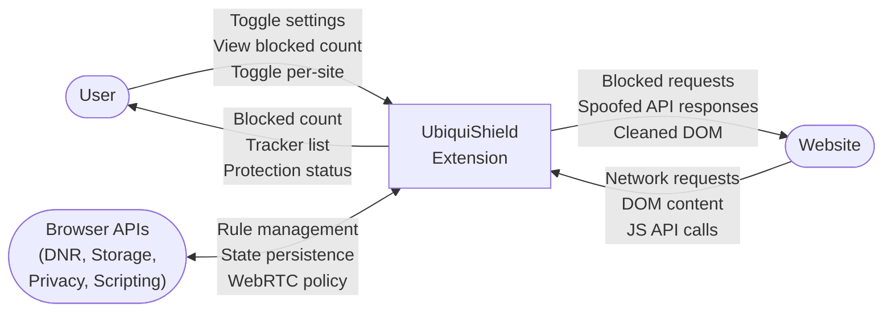

### Level 1 — Internal Processes

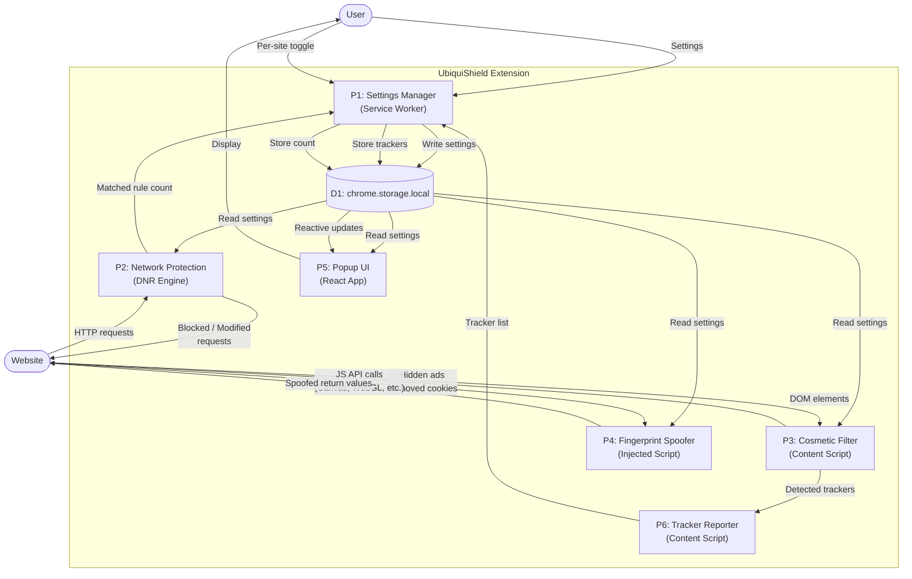

---

## A.2 System Flow Diagram

This diagram traces the complete lifecycle of a page load — from the moment the user navigates to a URL, through every protection layer, to the final rendered page.

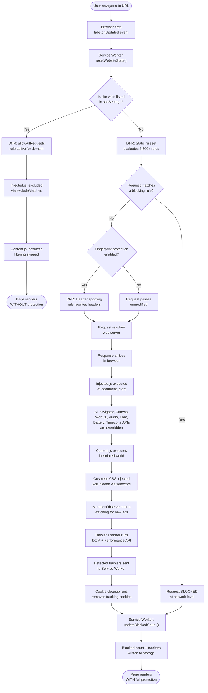

---

## A.3 Class Diagram

This diagram models the logical components of UbiquiShield as classes with their responsibilities and relationships. Since the extension is written in vanilla JavaScript (not OOP), this represents the conceptual module structure.

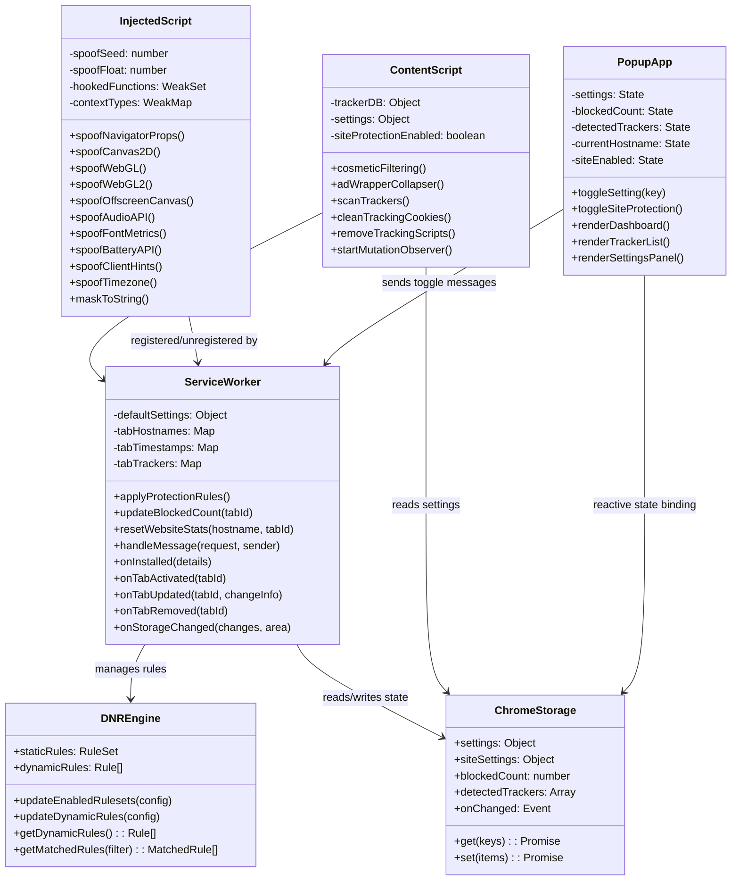

---

## A.4 Sequence Diagrams

### A.4.1 Page Load — Full Protection Flow

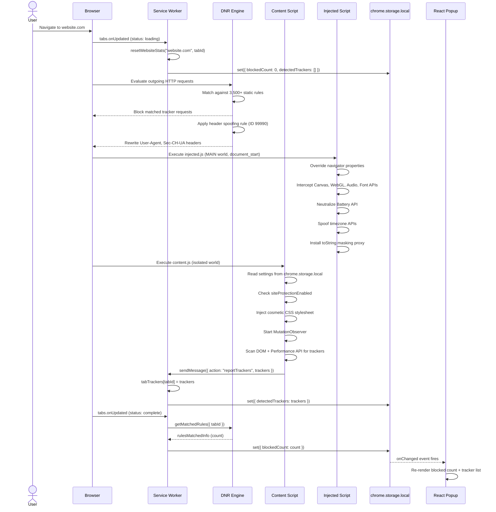

### A.4.2 User Toggles a Setting

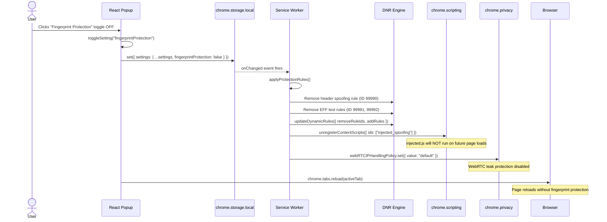

### A.4.3 User Disables Protection for a Specific Site

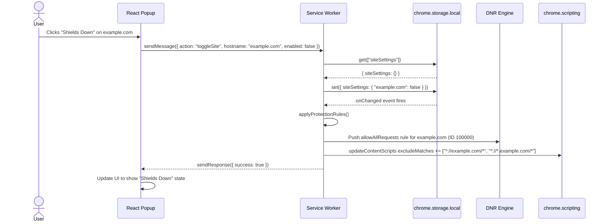

### A.4.4 Canvas Fingerprinting Attempt (Defeated)

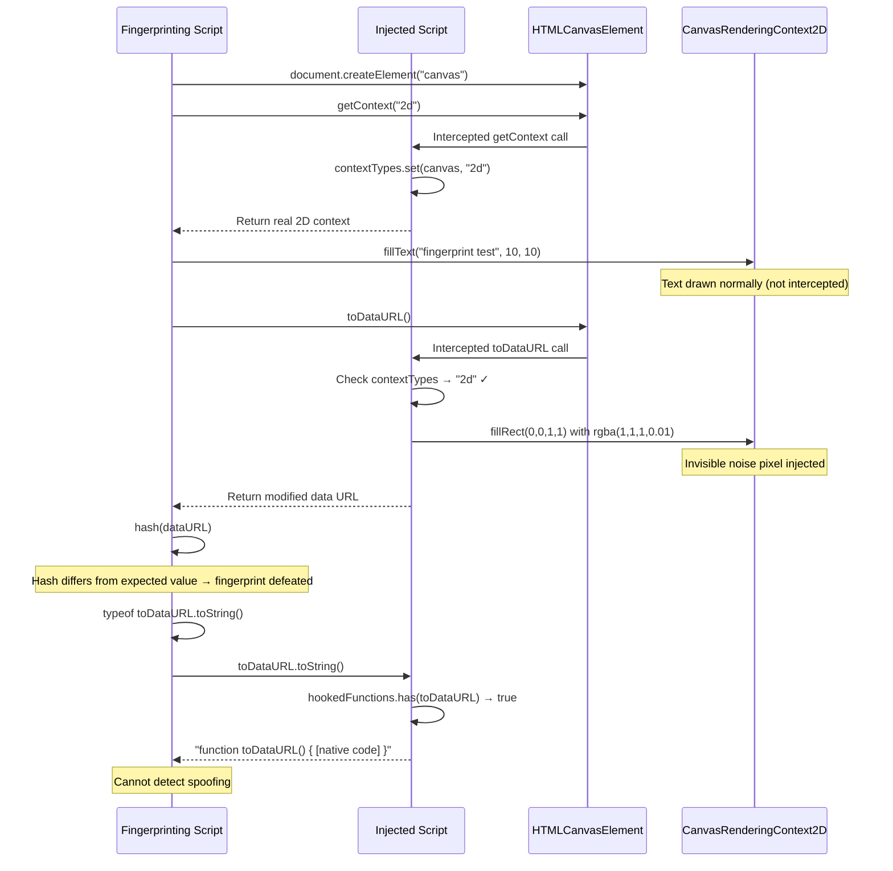

---

## A.5 Use Case Diagram

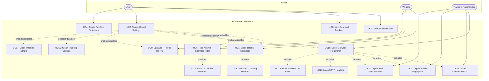

---

## A.6 Entity Relationship Diagram (ERD)

This diagram models the data entities and their relationships within `chrome.storage.local` and the in-memory runtime state.

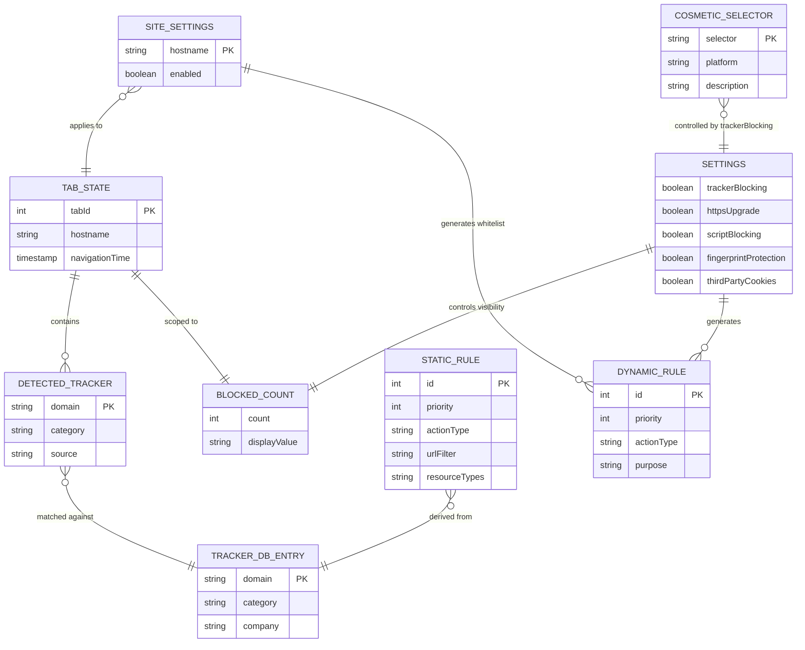

---
