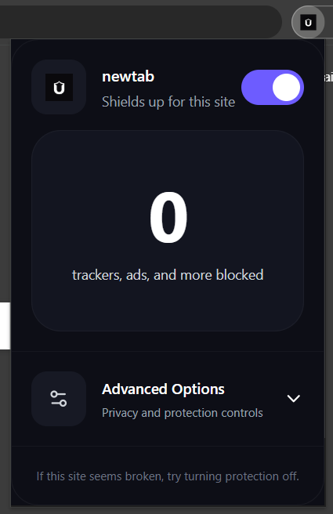
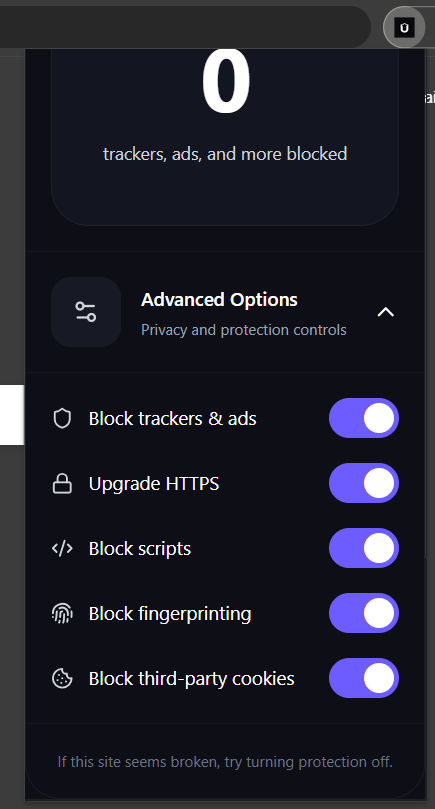
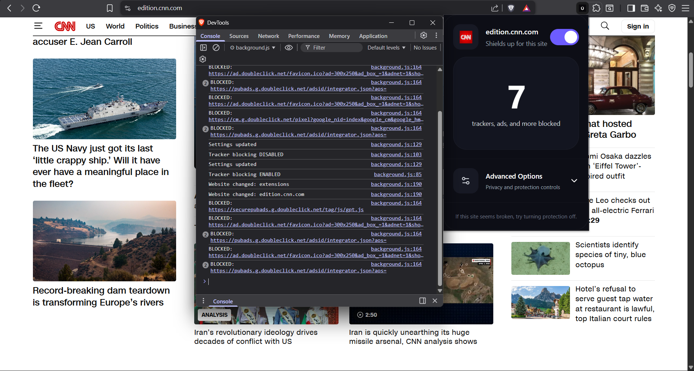
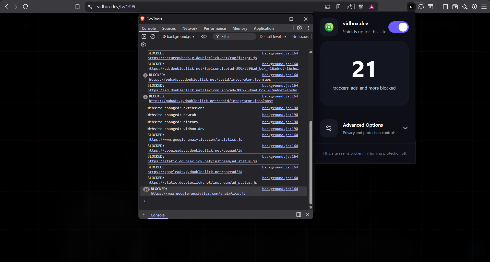
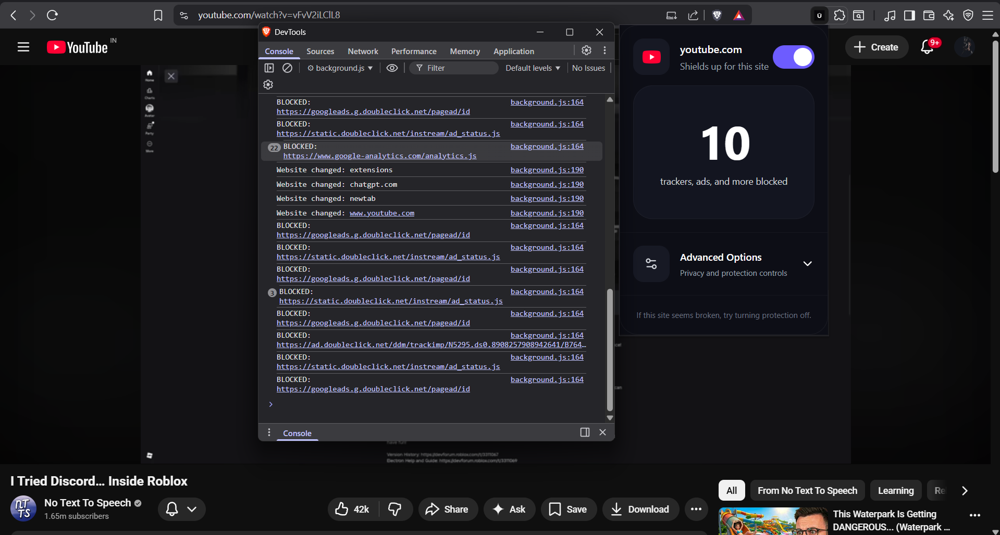

# Ubiqui_Shield

A lightweight privacy and tracker-blocking browser extension inspired by modern browser shields.

Ubiqui_Shield focuses on clean UI, fast performance, and essential privacy protections without unnecessary bloat.

---

## Features

* Tracker and ad blocking
* Third-party cookie blocking
* Script blocking
* Fingerprinting protection
* HTTPS upgrade support
* Live blocked request counter
* Per-feature protection toggles
* Website favicon and hostname detection
* Modern popup UI inspired by Brave Shields

---

## Current Protection Capabilities

Ubiqui_Shield currently blocks common tracking and advertising services including:

* DoubleClick
* Google Analytics
* Google Tag Manager
* Facebook trackers
* Hotjar
* Various known ad and analytics domains

The extension monitors requests in real time and applies protections directly through the browser extension API.

---

### Main Dashboard

- Website-specific protection
- Privacy Relay toggle
- Tracker statistics
- Advanced protection controls

---
## Tech Stack

### Frontend

* React
* Vite
* Tailwind CSS
* Lucide Icons

### Extension

* Chrome Extension Manifest V3
* Chrome Declarative Net Request API
* Chrome Storage API
* Content Scripts
* Background Service Workers

## Architecture

- React + Vite frontend
- Chrome Extension Manifest V3
- Background service worker
- Content script injection
- Local settings storage

---

## Project Structure

```bash
ubiqui_shield/
│
├── client/        # React popup UI
├── extension/     # Browser extension files
│   ├── background.js
│   ├── content.js
│   ├── manifest.json
│   └── rules.json
│
└── README.md
```

---

## Screenshots

### Main Interface



---

### Advanced Options



---

### Tracker Blocking




---

### ADS Blocking



---

### YouTube ADS Blocking



--- 

## Installation

### 1. Clone the repository

```bash
git clone https://github.com/unmukta/UbiquiShield.git
cd UbiquiShield
```

### 2. Install dependencies

```bash
cd client
npm install
```

### 3. Build the popup UI

```bash
npm run build
```

### 4. Copy build files

Copy everything from:

```bash
client/dist/
```

into:

```bash
extension/
```

---

## Load Extension in Brave / Chrome

1. Open:

```bash
brave://extensions
```

or

```bash
chrome://extensions
```

2. Enable **Developer Mode**

3. Click **Load unpacked**

4. Select the `extension/` folder

---

## Development

### Run frontend locally

```bash
cd client
npm run dev
```

### Lint project

```bash
npx eslint .
```

---

## Building Production Files

After every UI change:

```bash
npm run build
```

Copy contents from:

```text
client/dist/
```

into:

```text
extension/
```

Then reload extension.

---

## Current Status

The extension is actively under development.

Planned improvements include:

* Real filter list support
* Cosmetic ad removal
* Anti-adblock bypassing
* Per-site protection settings
* Advanced tracker intelligence
* Performance optimizations
* Web Store release preparation

---

## Current Limitations

- Does not yet support full EasyList filtering
- Cosmetic filtering is limited
- YouTube ads are partially blocked
- HTTPS upgrading is experimental
---

## Browser Support

- Google Chrome
- Microsoft Edge
- Chromium browsers

---

## Disclaimer

Ubiqui_Shield is an experimental privacy project intended for educational and development purposes.

Some protections may break functionality on certain websites depending on how aggressively resources are blocked.

---

## License

MIT License
